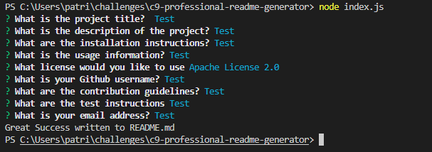

# Node.js Professional Readme Generator

## Table of Contents

[Description](#description)

[Installation Instructions](#installation)

[Usage Instructions](#usage)

[License](#license)

[Github](#github)

## Description

A command line run professional readme generator that takes a users input

[Screenrecording](./screenrecording.mp4)

## Installation Instructions

Download from Github

## Usage Instructions

cd to appropriate directory, run command node index.js, follow prompts, success message will be displayed upon generation of readme file

## License

[Apache License 2.0](https://opensource.org/licenses/Apache-2.0)

## Github

[patrickthegu](https://github.com/patrickthegu)

